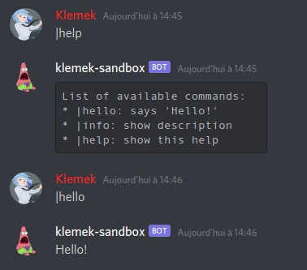

[](https://github.com/boyter/scc/#badges-beta)
[](https://lgtm.com/projects/g/Klemek/miniscord/alerts/)
[](https://lgtm.com/projects/g/Klemek/miniscord/context:python)
[](https://coveralls.io/github/Klemek/miniscord?branch=master)

# Miniscord
*A minimalist discord bot API*

```python
from miniscord import Bot
import discord


async def hello(client: discord.client, message: discord.Message, *args: str):
    await message.channel.send("Hello!")

bot = Bot(
    "test-app",     # name
    "0.1-alpha",    # version
    alias="|"       # respond to '|command' messages
)
bot.register_command(
    "hello",                    # command text (regex)
    hello,                      # command function
    "hello: says 'Hello!'",     # short help
    "```\n"                    # long help
    "* |help\n"
    "\tSays 'Hello!'.\n"
    "```"
)
bot.start()  # this bot respond to "|help", "|info" and "|hello"
```



> **⚠ Disclaimer:** I intend to use this project personally, I'm open to ideas but I don't care if it doesn't work for you. Same for the name, feel free to use it, I'm not registering it on PyPI

<!-- TOC depthFrom:2 depthTo:6 withLinks:1 updateOnSave:1 orderedList:0 -->

- [Features](#features)
- [Installation](#installation)
- [Documentation](#documentation)
	- [Bot init and launch](#bot-init-and-launch)
	- [Bot configuration properties](#bot-configuration-properties)
	- [Registering commands](#registering-commands)
	- [Registering fallback](#registering-fallback)
	- [Registering watcher](#registering-watcher)
	- [Game status](#game-status)
	- [Exposed utility functions](#exposed-utility-functions)
		- [`delete_message`](#deletemessage)
		- [`channel_id` / `sender_id`](#channelid-senderid)
- [Full example](#full-example)
- [Versions](#versions)
- [TODO](#todo)

<!-- /TOC -->

## Features

* Easy command registration
* Automatic help message
* Arguments splitting
* Message watcher registration
* Message handling configuration
* Static and dynamic custom game statuses

## Installation

**1. Install package**

```
pip install git+git://github.com/Klemek/miniscord.git
```

**2. Make a .env file as following**

```
#.env
DISCORD_TOKEN=<bot token from discordapp.com/developers>
```

## Documentation

### Bot init and launch

```python
bot = Bot(  
    "test-app",     # name
    "0.1-alpha",    # version
    alias="|"       # respond to '|command' messages
)  

# configure bot and register commands

bot.start()  # blocking function
```

### Bot configuration properties

* `token_env_var` (default: `"DISCORD_TOKEN"`)
  * Which var to read in the `.env` file.
* `remove_mentions` (default: `False`)
  * Remove any mention in the message / arguments.
* `any_mention` (default: `False`)
  * If the bot respond to a mention in the middle of messages.
* `log_calls` (default: `False`)
  * Log any calls to the Python logging.
* `guild_logs_file` (default: `"guilds.log"`)
  * Log guilds join/leave on a file.
* `enforce_write_permission` (default: `True`)
  * If the bot can't respond on a channel it was called, it sends a DM to the caller.
* `lower_command_names` (default: `True`)
  * Use lowercase on command names (if false, commands are case-sensitive).
* `game_change_delay` (default: `10`)
  * Change the game status every n seconds.
* `error_restart_delay` (default: `2`)
  * On crash, restart after n seconds.
* `answer` (default: `True`)
  * Use the answer capability on `help` and `info` functions
* `answer_mention` (default: `True`)
  * Mention author in the answer

### Registering commands

Register a custom function to be called on a certain keyword.

> Note : You can override the "help" and "info" commands by your own.

```python
async def hello(client: discord.client, message: discord.Message, *args: str):
    '''
    Parameters
    ----------
    client : discord.client
        Discord object used by the bot to interact with Discord API
        (see Discord documentation)
    message : discord.Message
        Discord object describing the message received via the Discord API
        (see Discord documentation)
    *args : str
        The message viewed as string arguments like a CLI
        (argument 0 will always be the command itself)
    '''
    if len(args) > 1:
        await message.channel.send(f"Hello {args[1]}!")
    else :
        await message.channel.send("Hello stranger!")

bot.register_command(
    "hello",                    # command text (regex)
    hello,                      # command function
    "hello: says 'Hello!'",     # short help
    f"```\n"                    # long help
    f"* |help\n"
    f"\tSays 'Hello!'.\n"
    f"```"
)
```

### Registering fallback

Register a custom function to be called when the bot is mentioned but no command was found.

```python
async def mention(client: discord.client, message: discord.Message, *args: str):
    """See 'Registering commands' for arguments description"""
    await message.channel.send(f"Did you mention me {message.author.mention}?")

bot.register_fallback(mention)  # the bot was mentioned or the alias was used
```

### Registering watcher

Register a custom function to be called on every messages except this bot own messages.

```python
async def message(client: discord.client, message: discord.Message):
    """See 'Registering commands' for arguments description"""
    if "catapult" on message.content:
        await message.channel.send(f"No profanity on this server")

bot.register_watcher(message)  # any message was sent (except this bot messages)
```

### Registering events

Register a [discord API event](https://discordpy.readthedocs.io/en/latest/api.html#discord-api-events)

The function must be exactly named after the event

```python
async def on_ready() -> bool:
    print("on_ready")
    return False  # if True is returned, prevent miniscord handling of the event

bot.register_event(on_ready)
```

### Game status

On starting, the bot will cycle through 2-3 "game status" (under its name as "playing xxx") :

* `v<version>`: current version registered in code
* `<n> guilds`: number of connected guilds
* `<alias>help`: command for help (if an alias is registered)

It will change its status every `game_change_delay` (default as 10 seconds).

You can add custom game statuses like this :

```python
bot.games += ["My custom message"]  # static message

value = 0
bot.games += [lambda: f"value:{value}"]  # dynamic message, computed at change
```

You can also remove the pre-existing statuses :

```python
bot.games = ["My custom message"]
```

### Exposed utility functions

Along with the bot are exposed several utility functions.

#### `delete_message`

Delete the given Discord message from the channel. Return `True` if the message was deleted successfully.

```python
from miniscord import delete_message
import asyncio

async def message(client: discord.client, message: discord.Message):
    if "catapult" in message.content:
        sent_msg = await message.channel.send(f"{message.author.mention} No profanity on this server")
        if await delete_message(message):
            await asyncio.sleep(5)
            await delete_message(sent_msg)
```

#### `channel_id` / `sender_id`

Helps identify where the discussion is happening (Might be used as a key in a state dictionary)

An user on multiple channels will have a unique id on each.

```python
from miniscord import channel_id, sender_id
from collections import defaultdict

channels = defaultdict(lambda:0)
senders = defaultdict(lambda:0)

async def mention(client: discord.client, message: discord.Message, *args: str):
    channels[channel_id(message)] += 1
    senders[sender_id(message)] += 1
    await message.channel.send(
        f"{message.author.mention} mentioned me {senders[sender_id(message)]} times on this channel\n"
        f"{channels[channel_id(message)]} mentions on this channel so far"
    )
```

## Full example

```Python
import logging
import discord
import asyncio
from collections import defaultdict
from miniscord import Bot, delete_message, channel_id, sender_id

channels = defaultdict(lambda:0)
senders = defaultdict(lambda:0)

logging.basicConfig(format="[%(asctime)s][%(levelname)s][%(module)s] %(message)s", level=logging.INFO)


async def hello(client: discord.client, message: discord.Message, *args: str):
    '''
    Parameters
    ----------
    client : discord.client
        Discord object used by the bot to interact with Discord API
        (see Discord documentation)
    message : discord.Message
        Discord object describing the message received via the Discord API
        (see Discord documentation)
    *args : str
        The message viewed as string arguments like a CLI
        (argument 0 will always be the command itself)
    '''
    if len(args) > 1:
        await message.channel.send(f"Hello {args[1]}!")
    else:
        await message.channel.send("Hello stranger!")


async def mention(client: discord.client, message: discord.Message, *args: str):
    channels[channel_id(message)] += 1
    senders[sender_id(message)] += 1
    await message.channel.send(
        f"{message.author.mention} mentioned me {senders[sender_id(message)]} times on this channel\n"
        f"{channels[channel_id(message)]} mentions on this channel so far"
    )


async def message(client: discord.client, message: discord.Message):
    if "catapult" in message.content:
        sent_msg = await message.channel.send(f"{message.author.mention} No profanity on this server")
        if await delete_message(message):  # False if "manage messages" permission not allowed
            await asyncio.sleep(5)
            await delete_message(sent_msg)


bot = Bot(
    "test-app",     # name
    "0.1-alpha",    # version
    alias="|"       # respond to '|command' messages
)

bot.register_command(
    "hello",                    # command text (regex)
    hello,                      # command function
    "hello: says 'Hello!'",     # short help
    "```\n"                    # long help
    "* |help\n"
    "\tSays 'Hello!'.\n"
    "```"
)

bot.register_fallback(mention)  # the bot was mentioned or the alias was used

bot.register_watcher(message)  # any message was sent (except this bot messages)

bot.games = [lambda:f"{sum(senders.values())} mentions"]  # custom dynamic game status
bot.game_change_delay = 1  # refresh game status every second

bot.start()  # this bot respond to "|help", "|info" and "|hello"
```

## Versions

* v0.0.3 : custom events handling
* v0.0.2 : new answer capability
* v0.0.1 : initial version

## TODO

* Expose more events
* Write more tests
* Add comments to code
* Separate branches
* Working CI
* Fix bugs
